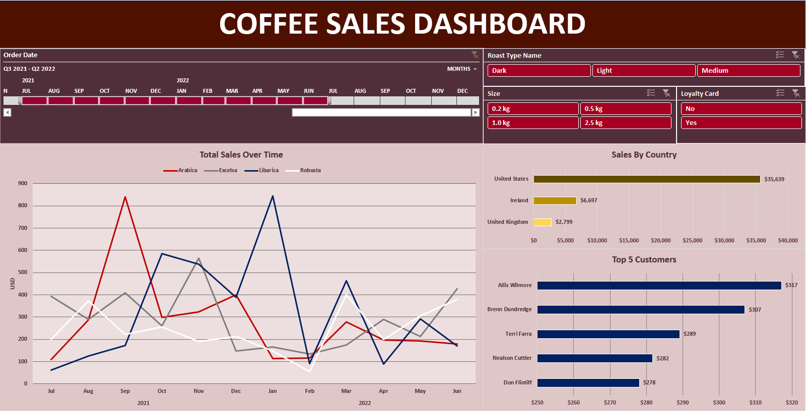

<h1 align="center">📊 Coffee Sales Interactive Dashboard 📊</h1>

 

👩‍💻 [**Check the Dashboard here!**](https://1drv.ms/x/c/8e8d9958fb97216d/EXtdI1GW7sNBu0CPkarh7GgBTcPkMiUMvl11yrZXXmrXsQ?e=1pGub1)

This dashboard showcases the most important KPIs that the business should be aware of about their Coffee sales. The excel techniques and tools used here are: XLOOKUP, INDEX - MATCH, Data Formatting, Pivot Tables, Charts, Timeline & Slicers.

1. **Business Problem & Data Cleaning**

    Data sheet includes coffeee orders between the years 2019 - 2022 along with Product and Customers information. The initial step included framing the business questions that stakeholder are looking to find answer:

    A. Out of the 4 Coffee Types, which one brings in the most sales and how does this figure vary based on time?
   
    B. Who are the top 5 customers for the business?
   
    C. Which countries are buying most of the products and by how much more?
   

3. **Sales Over Time**

    

4. **Sales By Country**

    

5. **Top Five Customers**

    

Recommendation:

*Focus on Expanding Sales in the U.S. Market* - The United States shows the highest sales, significantly outperforming other countries. It would be beneficial to continue investing in marketing and promotional activities in the U.S. to maintain this lead. Expanding loyalty programs and targeting the top customers from this region can drive further growth.

*Increase Sales in Underperforming Markets* - Ireland and the United Kingdom show significantly lower sales compared to the United States. Tailored promotions, pricing strategies, or product customization for these regions could help boost sales and create a more balanced global sales portfolio.

*Focus on Arabica and Liberica Coffee Types* - From the "Total Sales Over Time" graph, Arabica and Liberica varieties show strong sales peaks at certain times. Marketing efforts around these coffee types during high-demand periods could further enhance sales. Analyzing why these peaks occurred might provide insights for driving consistent sales growth across other months.
